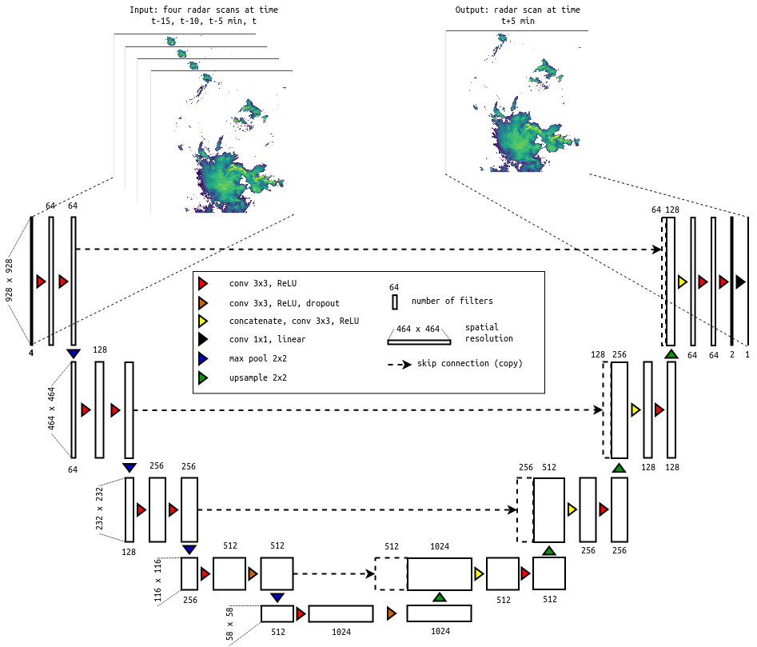
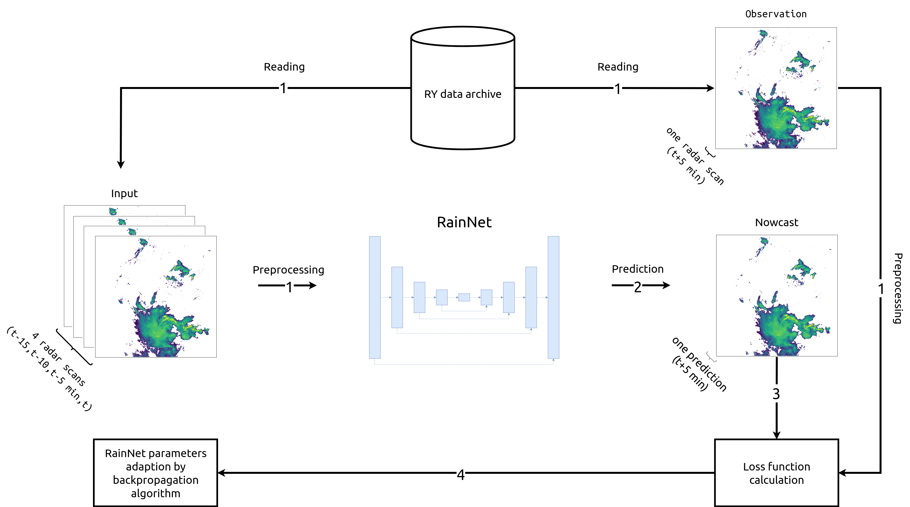

# RainNet: a convolutional neural network for radar-based precipitation nowcasting


## Brief description

Here we introduce RainNet -- a convolutional neural network for radar-based precipitation nowcasting. RainNet was trained to predict continuous precipitation intensities at a lead time of five minutes, using several years of quality-controlled weather radar composites provided by the German Weather Service (DWD). 

The source code of the RainNet model written using [_Keras_](https://keras.io) functional API is in the file `rainnet.py`.

The pretrained instance of `keras` `Model` for RainNet, as well as RainNet's pretrained weights are available on Zenodo: 

[](https://doi.org/10.5281/zenodo.3630429)

## Architecture

The RainNet's design was inspired by the [U-Net](https://arxiv.org/abs/1505.04597) and [SegNet](https://arxiv.org/abs/1511.00561) families of deep learning models which were originally designed for binary segmentation tasks. RainNet follows an encoder-decoder architecture in which the encoder progressively downscales the spatial resolution using pooling, followed by convolutional layers; and the decoder progressively upscales the learned patterns to a higher spatial resolution using upsampling, followed by convolutional layers. There are skip connections from the encoder to the decoder branches in order to ensure semantic connectivity between features on different layers.

In total, RainNet has 20 convolutional, four max pooling, four upsampling, two dropout layers, and four skip connections.



One of the prerequisites for U-Net based architectures is that the spatial extent of input data has to be a multiple of 2<sup>n+1</sup>, where _n_ is the number of max pooling layers. As a consequence, the spatial extent on different resolutional levels becomes identical for the decoder and encoder branches. Correspondingly, the radar composite grids were transformed from the native spatial extent of 900x900 cells to the extent of 928x928 cells using mirror padding.

[source: RainNet architecture](misc/RainNet_architecture.png)

[source: RainNet architecture by PyDot](misc/RainNet_architecture_pydot.png)

## Optimization procedure

In total, RainNet has almost 31.4 million parameters. We optimized these parameters using a procedure of which we show one iteration in [figure below](misc/RainNet_training_procedure.png).



First, we read a sample of input data that consists of radar scans at time _t-15_, _t-10_, _t-5_ minutes,  and _t_ (where _t_ is nowcast time), and a sample of the observed precipitation at time _t+5_. For both, input and observation, we increase the spatial extent to 928x928 using mirror padding, and transform precipitation depth _x_ (in mm) as follows :


Second, RainNet makes a prediction based on the input data. Third, we calculate a loss function that represents the deviation between prediction and observation. We use the _logcosh_ loss function as follows:


where _now_<sub>i</sub> and _obs_<sub>i</sub> are nowcast and observation at the _i_-th location, respectively; _cosh_ is the hyperbolic cosine function; _n_ is the number of cells in radar scans.

Finally, we update RainNet's model parameters to minimize the loss function using backpropagation algorithm where the [Adam](https://arxiv.org/abs/1412.6980v8) optimizer is utilized to compute the gradients.

We optimized RainNet's parameters using 10 epochs with a mini batch of size 2. The optimization procedure has converged on the 8<sup>th</sup> epoch showing saturation of RainNet's performance on the validation data.

The pretrained weights of the RainNet model are available on Zenodo: [](https://doi.org/10.5281/zenodo.3630429).

## Radar data

We use the sample of the [RY product]() of the German Weather Service (DWD) as input data for training and validating the RainNet model. The RY product represents a quality-controlled rainfall-depth composite of 17 operational DWD Doppler radars. It has a spatial extent of 900x900 km, covers the whole area of Germany, and is available since 2006. The spatial and temporal resolution of the RY product is 1x1 km and 5 minutes, respectively.

The sample data is available on Zenodo:

[](https://doi.org/10.5281/zenodo.3629951)

## Basic usage

**Prerequisites**: 
* Python 3.6+, 
* Keras 2.2+, 
* h5py 2.8
* pretrained RainNet model (file `rainnet.h5`) and its weights (file `rainnet_weights.h5`) has to be downloaded from the corresponding [Zenodo repository](https://doi.org/10.5281/zenodo.3630429): [](https://doi.org/10.5281/zenodo.3630429)

There are two scenarios of how to use the pretrained RainNet model.

The first scenario allows you to load the RainNet's model architecture alongside pretrained weights using built-in `keras` `load_model` function:

```python3
from keras.models import load_model

model = load_model("rainnet.h5")
```

The second scenario allows you to build the RainNet model from scratch using `rainnet` function from the module `rainnet.py` and then load pretrained weights stored in the file `rainnet_weights.h5`:

```python3
from rainnet import rainnet

model = rainnet()

model.load_weights("rainnet_weights.h5")
```

Having the RainNet model in place, you can then use built-in `keras` [`Model class API`](https://keras.io/models/model/), e.g., for running the RainNet model or evaluating its skill.

Some available options are:
* `model.predict(X)` -- runs the model with specified input data _X_ to obtain the corresponding nowcast.
* `model.evaluate(X, y)` -- returns the loss value for the model in test mode. Here X stands for input data, and y specifies ground truth data. 
* `model.summary()` -- creates a brief summary about model's layers and the number of parameters.
* `model.get_layer(name, index)` -- retrieves a layer based on either its name or index.


In case you only want to train  RainNet from scratch (on RY or some different radar data archive), you can avoid loading the provided pretrained weights. 
There is also an option to specify the input data shape using `input_shape` argument (just have in mind that the spatial extent of input data has to be a multiple of 2<sup>n+1</sup>, where _n_ is the number of max pooling layers (4 for the vanilla RainNet)). Then, use the code as follows:

```python3
from rainnet import rainnet

# you can pass the specific input shape of (x,y,z),
# where x and y provide the spatial extent, 
# and z specifies how many previous radar scans
# you want to account for.  
model = rainnet(input_shape=(x,y,z))
```

You can find more examples of RainNet usage in the corresponding `examples` subfolder, which is provided as a part of this repository.

## Reference
You can cite the RainNet model repository as follows: 

`Ayzel, G.: RainNet: a convolutional neural network for radar-based precipitation nowcasting. GitHub repository, https://github.com/hydrogo/rainnet, 2020.`

BibTeX:
```
@misc{Ayzel2020RainNet,
  author = {Ayzel, Georgy},
  title = {RainNet: a convolutional neural network for radar-based precipitation nowcasting},
  year = {2020},
  publisher = {GitHub},
  journal = {GitHub repository},
  howpublished = {\url{https://github.com/hydrogo/rainnet}}
}
```

## Contacts
Feel free to ask any questions about RainNet by [creating an issue](https://github.com/hydrogo/rainnet/issues).